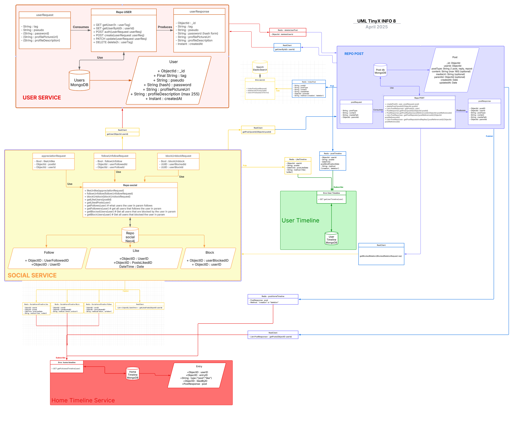

# Epitweet - Backend

## Overview
Epitweet Backend is a Twitter-like API developed using **Quarkus** and **Maven**. It is built with a **microservices architecture**, consisting of:
- `user-service`: Handles user authentication and management.
- `repo-post`: Manages post creation, retrieval, and interactions.
- `search-service`: Handles post indexing and searching via Elasticsearch.
- `social-service`: Handles relations between users (like, follow, block) and assist generating timelines.
- `user-timeline-service`: Manages retrieval and updates of user timelines (authored and liked posts, sorted by date).
- `home-timeline-service`: Manages retrieval and updates of home timelines (authored and liked posts, sorted by date).

## Table of contents

- [Overview](#overview)  
- [API Documentation](#api-documentation)  
- [Project Structure](#project-structure)  
- [Project UML Diagram](#project-uml-diagram)
- [Building the Project](#building-the-project)  
  - [1. Start Databases and Redis](#1-start-databases-and-redis)  
  - [2. Build All Modules](#2-build-modules)  
- [Running the Project](#running-the-project)  
  - [Start Services](#start-services)  
- [Testing the Project](#testing-the-project)  
  - [1. Running Unit Tests (Per Module)](#1-running-unit-tests-per-module)  
  - [2. Running All Unit Tests (All Module)](#2-running-all-unit-tests-all-module)  
  - [3. Running Integration Tests](#3-running-integration-tests)  
- [Technical Specifications](#4-technical-specifications)

## API Documentation
The APIs for Epitweet are documented using **Swaggers**:
- [Swagger UI - Epitweet Backend](https://app.swaggerhub.com/apis/info8-925/Epitweet_Evolved/1.0.0/) to interact with all available endpoints. You can test the endpoints and view request/response formats.
- Each module contains their proper part swagger in `resources/`

## Project Structure
```
Epitweet/
├── docker/                # Docker setup files
│   ├── docker-compose.yml
│   ├── init_mongo.js
│
├── common/                # Common utils 
│   ├── src/               
│   ├── pom.xml
│
├── repo-post/             # Post management microservice
│   ├── src/               # Port 8082
│   ├── pom.xml            # Database - MongoDB 
│
├── user-service/          # User management microservice
│   ├── src/               # Port 8081
│   ├── pom.xml            # Database - MongoDB
│
├── search-service/        # Search management microservice
│   ├── src/               # Port 8083
│   ├── pom.xml            # Database - ElasticSearch
│
├── social-service/        # Social management microservice
│   ├── src/               # Port 8084
│   ├── pom.xml            # Database - Neo4j

├── user-timeline-service/ # User timeline management microservice
│   ├── src/               # Port 8085
│   ├── pom.xml            # Database - MongoDB

├── home-timeline-service/ # Home timeline management microservice
│   ├── src/               # Port 8086
│   ├── pom.xml            # Database - MongoDB

├── integrationTests.http   # HTTP test file for API calls
├── pom.xml                 # Parent Maven project configuration
├── README.md               # Project documentation
```

## Project UML Diagram

The following UML diagram provides an overview of Epitweet's microservices architecture, their responsibilities, and interactions:



It can be fully openned on its `pdf` format at this following path : `docs/uml_diagram.pdf`.


## Building the Project

### 1. Start Databases and Redis
Run the following command to start all **databases** and **Redis** using Docker Compose:
```sh
cd docker
docker-compose up -d
```
This will start:
- 🟢 MongoDB (users, posts, timelines)

- 🔵 Elasticsearch (search indexing)

- 🟠 Neo4j (social graphs)

- 🔴 Redis (asynchronous relations between modules)

Then, you can build the entire project or individual modules.

If you want to connect to Mongo DB from container:
```sh
docker exec -it epitweet_td_mongo mongosh -u admin -p admin --authenticationDatabase admin Epitweet
```

### 2. Build Modules
Run one of the following command at the root of the project:
```sh
mvn clean install
--
mvn package
```

## Running the Project

### Start services
To start all backend services, open separate terminal windows and run the following commands:
```sh
# Start the common module
./mvnw quarkus:dev -pl common/

# Start the user-service
./mvnw quarkus:dev -pl user-service/

# Start the repo-post service
./mvnw quarkus:dev -pl repo-post/

# Start the srvc-search service
./mvnw quarkus:dev -pl search-service/

# Start the social service
./mvnw quarkus:dev -pl social-service/

# Start the user timeline service
./mvnw quarkus:dev -pl user-timeline-service/

# Start the home timeline service
./mvnw quarkus:dev -pl home-timeline-service/
```

## Testing the Project
The project includes both **module tests** (unit tests) and **integration tests**.

### 1. Running Unit Tests (Per Module)
To run unit tests for a specific service, you must first shut down all the running services. This is because the unit tests will restart the specific service to perform the tests.

Run the tests for a specific service:

For exemple, to run user-service modular tests:
```sh
# Run tests for user-service
cd user-service
mvn test
```
### 2. Running All Unit Tests (All Module)
To run all module tests, run the following command  :

```sh
mvn verify
```

### 3. Running Integration Tests
To run integration tests, you have to start all services as seen above.

Then you can check integration tests with:
- **IntegrationTests.http**
    
    In the folder `integration-tests/`, there is a test file (.http) for each module. Plus, the `globalIntegrationTests.http` adds some global tests that simulate a simple scenario of utilisation that uses all modules. 
- **Swagger UI** (links above) to test manually all endpoints.

---

### 4. Technical Specifications

To maintain code quality, consistency, and a clear separation of concerns across the project, we have implemented the following development practices and tools:

- **Checkstyle**  
    We use Checkstyle as an automated **code style** checker to ensure that all contributors follow a consistent coding standard. This helps improve readability and maintainability across the codebase.

- **Logging**  
    Each module includes a **Logger** implementation to facilitate better monitoring and debugging:
    - **Controllers** log incoming requests and outgoing responses.
    - **Repositories** log interactions with the database.
    - **Publishers/Subscribers** log event publishing and consumption.

- **Javadoc**  
    We generate API documentation automatically using Maven's Javadoc plugin:

    ```bash
    mvn javadoc:javadoc
    ```
    The generated documentation is available in the `target/` directory.

- **Converters**
    To enforce separation of concerns, we use dedicated Converter classes that handle transformations:

    - From CTOs (Client Transfer Objects) to Entities

    - From Entities to CTOs

    This approach ensures clear decoupling between data representation layers and business logic.

- **Common module**
    To remove redondant code and regroupe shared CTOs class between services.